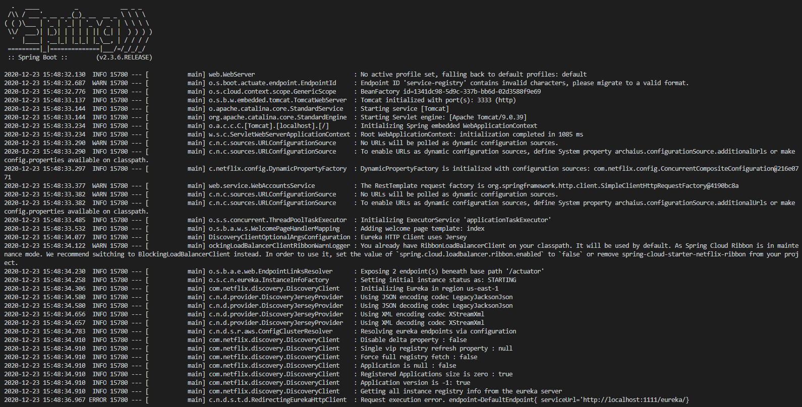
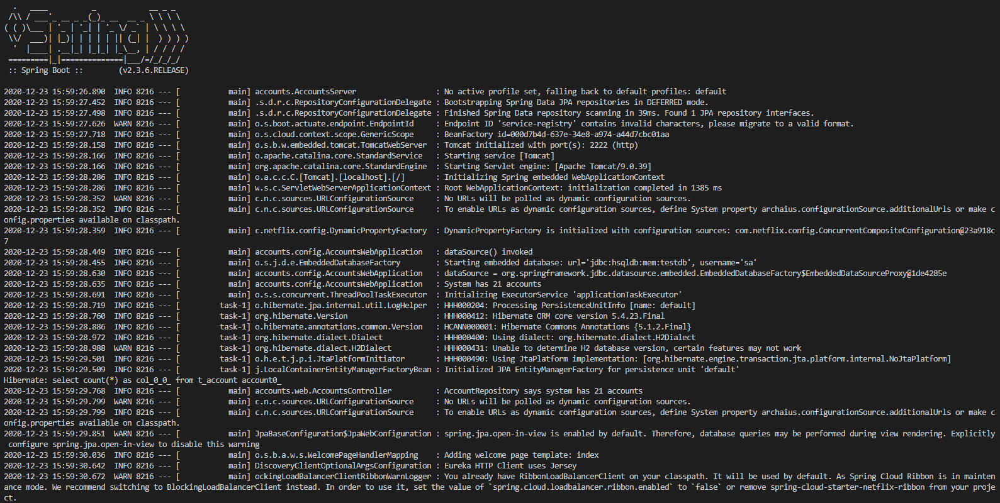
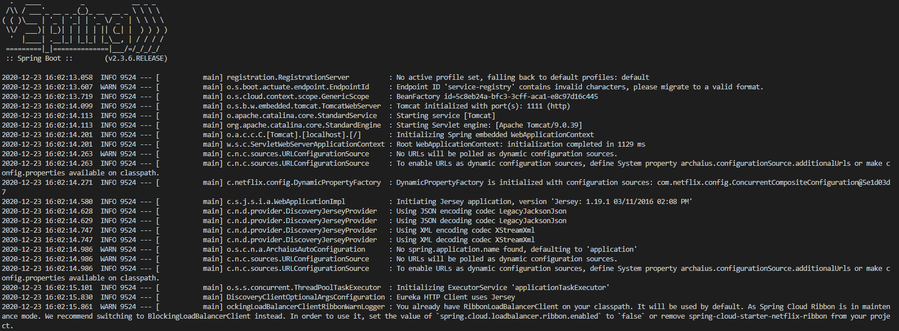
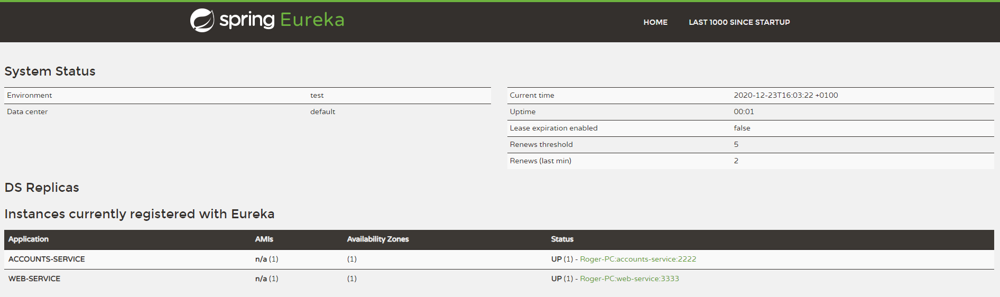
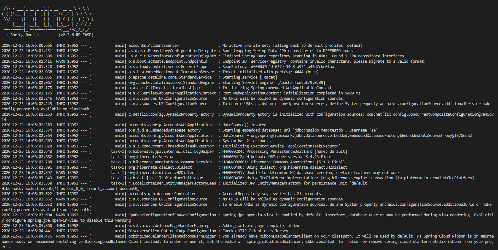
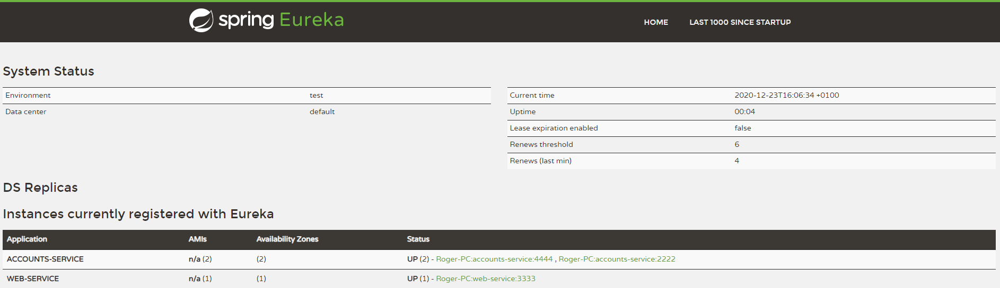

En este fichero voy a comentar como se han completado los distintos objetivos de esta práctica.
-Primero, se ha iniciado el servicio de web mediante gradle :web:bootRun, y vemos que está en el puerto 3333.

        También se ha iniciado un servicio account mediante gradle :account:bootRun en una terminal nueva, y vemos que está  en el puerto 2222.

Después, vamos a abrir una tercera terminal con el servicio de registration mediante gradle :registration:bootRun, el cual tiene los otros microservicios capturados, y lo veremos en el Dashboard (localhost:1111).

        Y el dashboard.

Ahora abriremos otro servicio account, modificando dentro de su fichero aplication.yml el puerto a 4444, y abrimos con el mismo comando en una cuarta terminal el servicio.

        Y vemos de nuevo el dashboard, el cual incluye ahora el nuevo servicio.

Por último, matamos el servicio de account que hemos abierto primero mediante CTRL+C, y si recargamos el dashboard de Eureka veremos un mensaje de emergencia, comunicando que no está seguro de tener los servicios actualizados, pero debido a la falta de renovaciones no lo elimina, y por tanto mantenemos ambos servicios de accounts.